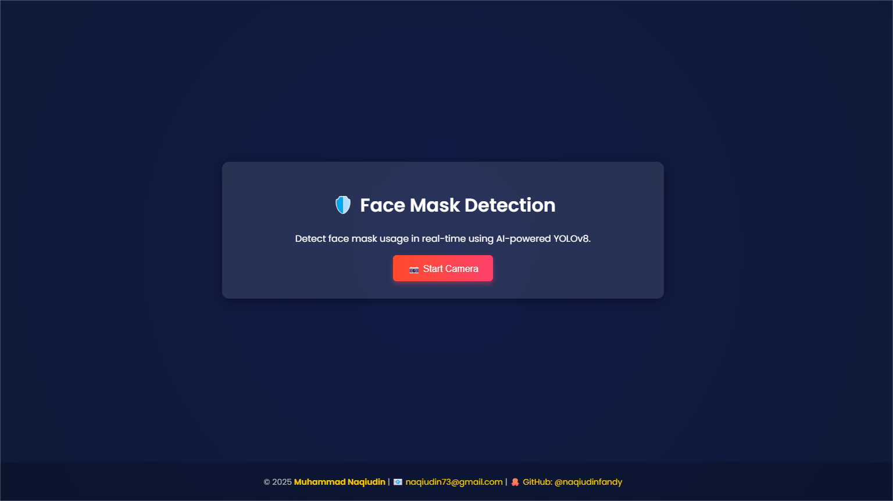
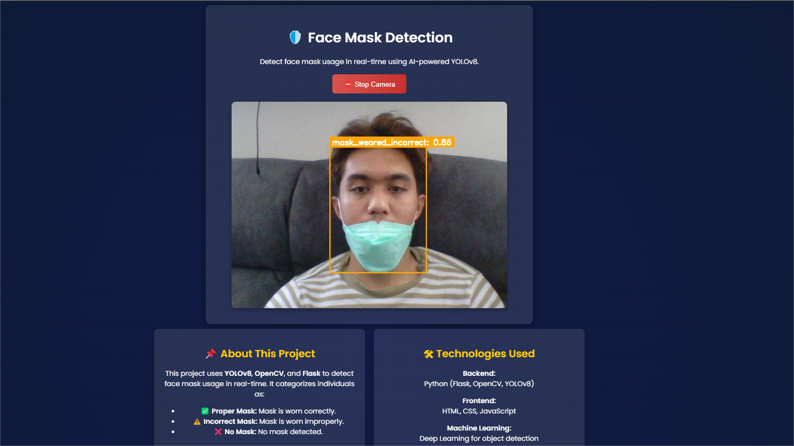
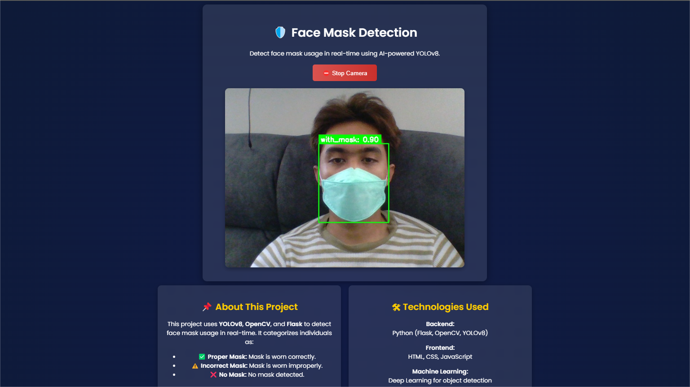
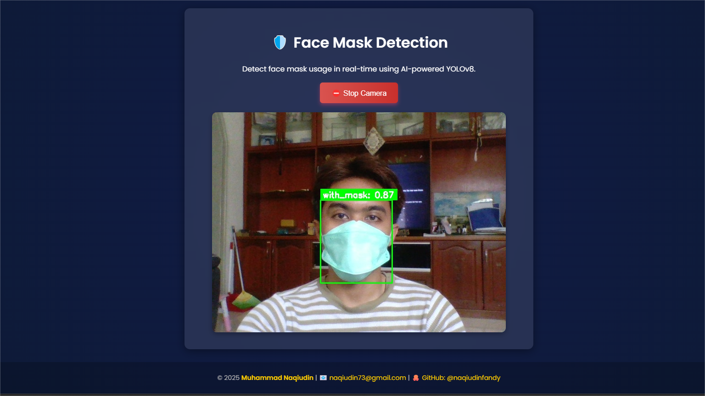
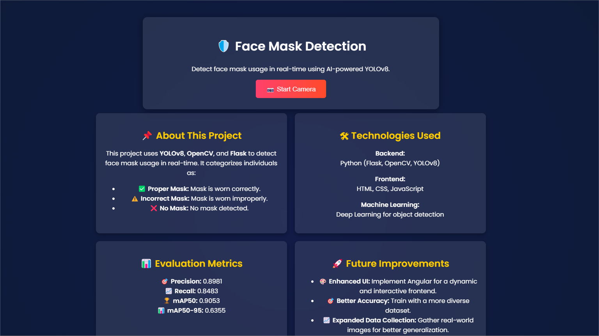
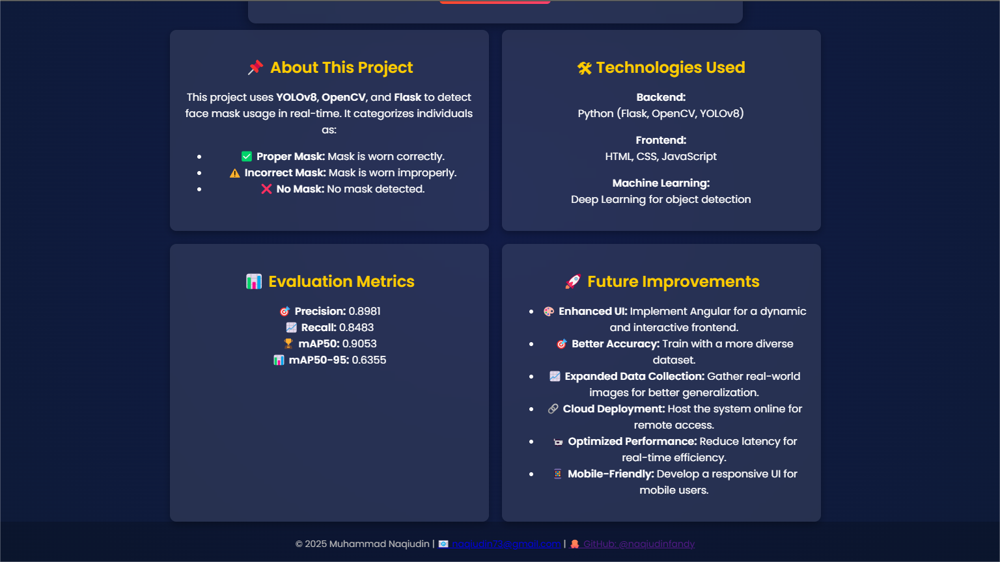

# 🛡️ Face Mask Detection using YOLOv8 & OpenCV

## 📌 Project Overview  
This project is a **real-time Face Mask Detection system** built using **YOLOv8** and **OpenCV**. It detects whether a person is wearing a mask properly and classifies it into three categories:  

✅ **Good** (Green) – Mask worn correctly  
⚠️ **Moderate** (Yellow) – Mask worn incorrectly  
❌ **Bad** (Red) – No mask detected  

The system can be used in **public places, offices, and educational institutions** to monitor mask usage effectively.

---

## 🛠️ Technologies Used  
- **Python** (Core programming language)  
- **YOLOv8** (Ultralytics for object detection)  
- **OpenCV** (Real-time video processing)  
- **Flask** (For the web-based interface)  
- **HTML, CSS, JavaScript** (Frontend)  
- **Bootstrap** (UI Styling)  

---

## 🎯 Features  
✅ **Real-time face mask detection**  
✅ **Web-based user interface**  
✅ **Supports multiple video sources (Webcam, CCTV, Video files)**  
✅ **Responsive UI with smooth transitions**  
✅ **Performance metrics & evaluation**  

---

## 📊 Evaluation Metrics  
| Metric  | Value  |
|---------|--------|
| **Precision**  | 0.8981  |
| **Recall**  | 0.8483  |
| **mAP@50**  | 0.9053  |
| **mAP@50-95**  | 0.6355  |

---

## 📸 UI & Output Images  
Here are some screenshots of the system in action:

### 🔹 **User Interface Screens**  
  
  
  
  
  
  

---

## 🚀 Future Improvements  
🔹 **Enhance UI using Angular framework** for a more dynamic front-end.  
🔹 **Improve accuracy** with a larger dataset and fine-tuned YOLOv8 model.  
🔹 **Integrate a mobile app** for remote mask detection monitoring.  
🔹 **Deploy the system on cloud** for real-time access from anywhere.  

---

## 📌 How to Run the Project  

### 🔹 **1. Clone the Repository**
```sh
git clone https://github.com/naqiudinfandy/Facemask-detection-YOLOv8-OpenCV.git
cd Facemask-detection-YOLOv8-OpenCV
